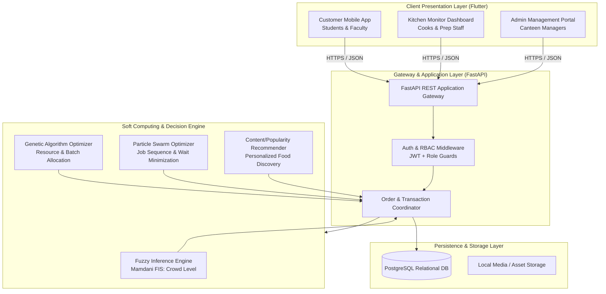
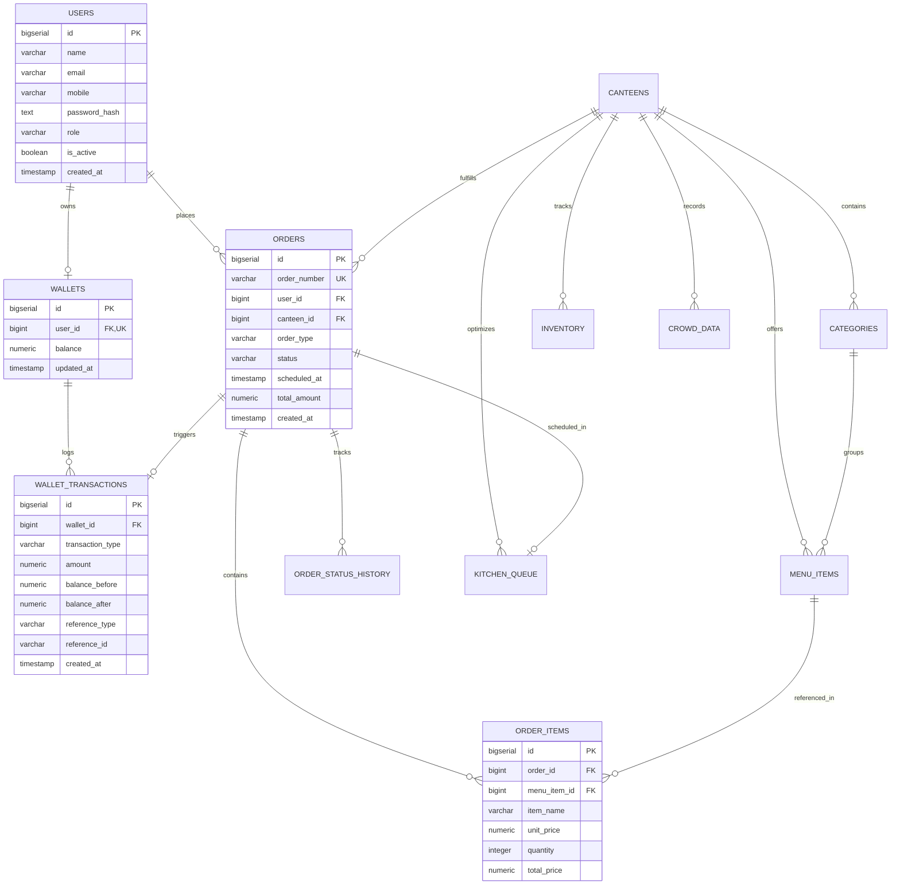
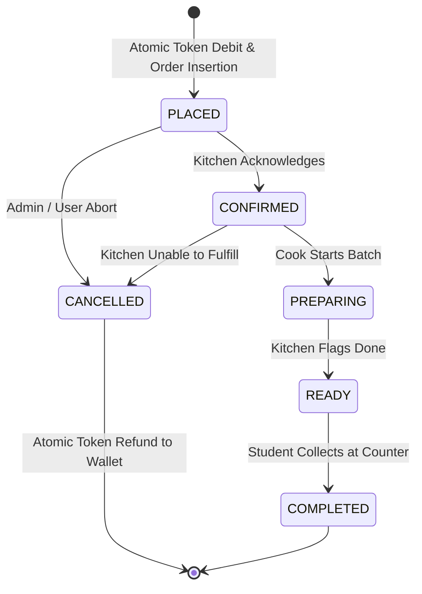

# Smart Canteen Management System: Master Engineering Specification & Implementation Plan
**Document Version:** 1.0.0  
**Project Classification:** Soft Computing Course Project (40 Marks Prototype) with Architectural Extensibility to Final Year Capstone  
**Target Duration:** 4–5 Days (12–15 Engineering Hours Total)  
**Primary Stack:** Flutter (Mobile + Web), Python (FastAPI), PostgreSQL (SQLAlchemy + Alembic), Soft Computing (scikit-fuzzy, NumPy, custom GA/PSO)

---

## Table of Contents
1. [Executive Summary & Scope Boundary](#1-executive-summary--scope-boundary)
2. [High-Level System Architecture](#2-high-level-system-architecture)
3. [User Experience & Screen-by-Screen UI Specifications](#3-user-experience--screen-by-screen-ui-specifications)
4. [Relational Database Schema & DDL Specification](#4-relational-database-schema--ddl-specification)
5. [Complete REST API Specification](#5-complete-rest-api-specification)
6. [Soft Computing & Intelligent Engine Specifications](#6-soft-computing--intelligent-engine-specifications)
   - 6.1 [Fuzzy Inference System: Canteen Crowd & Rush Level](#61-fuzzy-inference-system-canteen-crowd--rush-level)
   - 6.2 [Genetic Algorithm: Food Preparation & Resource Allocation](#62-genetic-algorithm-food-preparation--resource-allocation)
   - 6.3 [Particle Swarm Optimization: Kitchen Order Scheduling](#63-particle-swarm-optimization-kitchen-order-scheduling)
   - 6.4 [Hybrid Fuzzy-GA Decision Module](#64-hybrid-fuzzy-ga-decision-module)
   - 6.5 [Item Recommendation Engine](#65-item-recommendation-engine)
7. [Atomic Financial Wallet & Order Lifecycle Engine](#7-atomic-financial-wallet--order-lifecycle-engine)
8. [Kitchen Monitor & Admin Operations Engine](#8-kitchen-monitor--admin-operations-engine)
9. [Comprehensive Test Suite & Quality Assurance Plan](#9-comprehensive-test-suite--quality-assurance-plan)
   - 9.1 [Unit Test Cases (Backend & Logic)](#91-unit-test-cases-backend--logic)
   - 9.2 [Financial Concurrency & Double-Spend Tests](#92-financial-concurrency--double-spend-tests)
   - 9.3 [Soft Computing Algorithmic Test Suites](#93-soft-computing-algorithmic-test-suites)
   - 9.4 [Frontend Integration & E2E Test Cases](#94-frontend-integration--e2e-test-cases)
10. [Step-by-Step 5-Day Implementation Roadmap](#10-step-by-step-5-day-implementation-roadmap)
11. [Project Directory Layout & Dependency Blueprint](#11-project-directory-layout--dependency-blueprint)

---

## 1. Executive Summary & Scope Boundary

The **Smart Canteen Management System** addresses systemic inefficiencies in institutional campus cafeterias: excessive queueing during peak hours, kitchen preparation bottlenecks, manual paper reconciliation, cash/change friction, and unpredictable food wastage. 

For the **Course Project (40 Marks)**, the focus is concentrated on demonstrating **practical applications of Soft Computing algorithms** directly aligned with the curriculum (Fuzzy Logic, Genetic Algorithms, Particle Swarm Optimization, and Hybrid Systems), integrated into a clean, working full-stack prototype without unnecessary operational overhead.

### Scope Matrix: Course Project vs. Future Final Year Scope

| Subsystem / Feature | Course Project (Current Frozen Scope) | Future Final Year Capstone Scope |
| :--- | :--- | :--- |
| **Mobile Client** | Flutter cross-platform mobile client (Customer App) | Production iOS/Android release with offline sync |
| **Web Dashboards** | Flutter Web (Kitchen Monitor + Admin Dashboard) | React/Next.js multi-tenant dashboard |
| **Database** | PostgreSQL relational DB with normalized schema | PostgreSQL with read-replicas, Redis caching layer |
| **Authentication** | JWT Auth with bcrypt password hashing (Role-based) | OAuth2.0 / SSO (Campus ID integration) + MFA |
| **Canteens Supported** | 2 Canteens (Main Canteen & Food Court) | Dynamic multi-campus, multi-vendor support |
| **Digital Wallet** | Closed-loop token ledger (1 Token = ₹1), Admin credit | UPI/Payment Gateway integration (Razorpay/Stripe) |
| **Table Ordering** | Manual selection / In-app table routing | Dynamic physical QR code table scanning & validation |
| **Real-Time Sync** | Polling / REST state transitions | WebSockets / gRPC duplex streaming |
| **Notifications** | In-app status badges and dialog banners | Firebase Cloud Messaging (FCM) push notifications |
| **Crowd Intelligence** | Mamdani Fuzzy Inference System (simulated inputs) | ESP32 + Dual IR breakbeam hardware sensors |
| **Kitchen Scheduling** | Particle Swarm Optimization (PSO) waiting time minimizer | Multi-station shop-floor dynamic dispatch |
| **Preparation Allocation**| Genetic Algorithm (GA) resource optimizer | Real-time demand forecasting ML + GA hybrid |
| **Audit & Integrity** | Immutable PostgreSQL ledger table | Hyperledger Fabric private permissioned blockchain |

---

## 2. High-Level System Architecture



---

## 3. User Experience & Screen-by-Screen UI Specifications

### 3.1 Customer Mobile Application (Flutter)

#### Screen C-01: Splash & Pre-Auth Route Guard
- **Visual Elements:** Central brand iconography, stylized typography (`Smart Canteen`), tagline (`Fast • Intelligent • Seamless`), subtle progress shimmer.
- **Behavior:** 
  1. Checks local secure storage for stored JWT access token.
  2. If valid token exists, queries `GET /api/v1/auth/me` to refresh user context and navigates to `Home Screen`.
  3. If expired or non-existent, transitions after 2.0 seconds to `Authentication Screen`.

#### Screen C-02: Registration Screen
- **Input Fields:**
  - `Full Name` (Text, validation: length >= 3)
  - `Email Address` (Email format regex check)
  - `Mobile Number` (10-digit numeric constraint, Indian phone standard regex `^[6-9]\d{9}$`)
  - `Password` (Min 6 characters, masked with visibility toggle)
- **Actions:**
  - `Register` button (disables during network call, triggers loading indicator).
  - Navigation link: *"Already have an Account? Login Here"* $\rightarrow$ routes to C-03.

#### Screen C-03: Login Screen
- **Input Fields:**
  - `Mobile Number` (10-digit numeric constraint)
  - `Password` (Masked input)
- **Actions:**
  - `Login` button $\rightarrow$ calls `POST /api/v1/auth/login`. On success: stores JWT token in `flutter_secure_storage`, sets Riverpod auth state, redirects to C-04.
  - Navigation link: *"Don't have an Account? SignUp Here"* $\rightarrow$ routes to C-02.

#### Bottom Navigation Container (Persistent 4 Tabs)
Appears permanently after authentication across tabs:
`[ 🏠 Home ]` | `[ 🧾 History ]` | `[ 🛒 Cart (Badge: N) ]` | `[ 👤 Profile ]`

#### Screen C-04: Home Screen (Discovery Hub)
- **Header:** Greeting (`Hello, {User.Name} 👋`), User Avatar, and Wallet Quick Badge (`🪙 {Balance} Tokens`).
- **Section 1 - Recommendation Carousel:**
  - Horizontal swipeable cards generated dynamically via soft-computing/popularity ranking.
  - Card displays: Item image, Canteen origin badge, Name, Price (`₹45` ~~`₹55`~~), Rating badge (`⭐ 4.6`).
  - Interaction: Tapping a card routes directly to Screen C-07 (Food Detail) pre-scoped to that canteen.
- **Section 2 - Canteen Selector Cards:**
  - 2 primary cards: **Main Canteen** and **Food Court**.
  - Visuals: High-quality squared thumbnail, opening hours, active status pill (`OPEN` / `CLOSED`).
  - Real-Time Intelligence Badge: 
    - Calculated directly via Fuzzy Inference System.
    - Example: `🟢 Low Crowd (~3 min wait)` or `🟡 Moderate Crowd (~8 min wait)` or `🔴 High Rush (~15 min wait)`.
  - Tapping opens Screen C-05 for that selected canteen.

#### Screen C-05: Canteen Home & Category View
- **Header Banner:** Canteen details, operational status, Fuzzy Crowd indicator banner.
- **Top Carousel:** In-canteen trending/recommended dishes.
- **Category Tabs / Grid:**
  - `🥣 Soups` | `🥤 Drinks` | `🍟 Snacks` | `🍛 Main Course` | `🍰 Desserts`
- **Menu Items List under active category:**
  - Product Card: Image thumbnail, Veg/Non-Veg indicator, Item Name, Preparation time (`~8m`), Price and Strikethrough Discount, Stepper component (`[ - ] QTY [ + ]`), and `Add to Cart` button.

#### Screen C-06: Food Item Details Screen
- **Visuals:** Full-width header image, category breadcrumb, detailed description.
- **Nutritional & Preparation Metadata:** Estimated preparation duration, stock availability counter.
- **Action Bottom Bar:** Dynamic subtotal calculation based on selected counter, sticky `Add to Cart` CTA.

#### Screen C-07: Cart Screen (Strict Single-Canteen Scoping)
- **Architectural Guard:** A cart can only contain items from **one canteen** at a time. Adding an item from a different canteen triggers a confirmation dialog: *"Clear existing cart from {Old Canteen} to add items from {New Canteen}?"*.
- **List Items:** Item name, unit price, quantity modifier (`+`/`-`), line total.
- **Financial Summary:** Subtotal (Tokens), Tax/Charges (₹0 in prototype), Net Payable Tokens.
- **Action:** `Proceed to Pay` button $\rightarrow$ opens Screen C-08.

#### Screen C-08: Order Summary & Checkout (Advance Scheduling)
- **Order Breakdown:** Itemized receipts with token amounts.
- **Order Timing Radio Selector:**
  - `(o) Immediate (Prepare Now)`
  - `( ) Advance Order (Schedule for later)`
    - If selected: renders Material DatePicker (current day restriction) and TimePicker (minimum offset: `current_time + 20 minutes`).
- **Live Wallet Ledger Calculation:**
  - Current Token Balance: `🪙 450`
  - Order Cost: `- 🪙 140`
  - Projected Remaining Balance: `🪙 310`
  - *Validation Guard:* If `Current Balance < Order Cost`, button is disabled with error banner: *"Insufficient Tokens. Please contact Canteen Admin for token top-up."*
- **Submission Action:** `Confirm & Place Order` $\rightarrow$ executes atomic ACID order creation.

#### Screen C-09: Order Confirmation Screen
- **Success Graphic:** Animated checkmark.
- **Token Identifier:** Prominent Digital Token Number (e.g., `#A-1042`).
- **Summary:** Items purchased, Scheduled time (or "Immediate"), estimated prep time.
- **Wallet Status:** Updated balance confirmation.
- **Action:** `Track Order / Continue Shopping`.

#### Screen C-10: Order History Screen
- **List View:** Chronological sequence of past orders.
- **Card Content:** Date & Timestamp, Canteen Name, Item summary (`2x Veg Sandwich, 1x Cold Coffee`), Total Tokens, Status Pill (`PLACED`, `PREPARING`, `READY`, `COMPLETED`, `CANCELLED`).
- **Interactive Details Sheet:** Tap opens full digital invoice with timestamp breakdown.

#### Screen C-11: Profile & Wallet Ledger Screen
- **User Information:** Full Name, Registered Email, Mobile Number, Avatar placeholder.
- **Wallet Card:** Digital Token Balance with large typography.
- **Ledger History Sub-List:** Shows last 10 transactions (`+500 Admin Top-Up`, `-140 Order #1042`).
- **Actions:** Logout (clears secure storage, invalidates session).

---

### 3.2 Kitchen Monitor Application (Flutter Web / Tablet)

#### Screen K-01: Real-Time Order Stream & PSO Queue
- **Split Screen Layout:**
  - **Left Pane: Immediate Active Orders:** Grouped by status cards (`PLACED` $\rightarrow$ `PREPARING` $\rightarrow$ `READY`).
  - **Right Pane: Advance Scheduled Orders:** Sorted chronologically by `scheduled_at`. Highlighted in amber when within 15 minutes of trigger window.
- **PSO Optimized Sequence Banner:**
  - Displays algorithmically optimal preparation sequence to minimize cumulative customer wait times.
  - Example: `Recommended Queue Sequence: Order #1043 -> Order #1041 -> Order #1044`.
- **Order Card Anatomy:**
  - Token Number (`#1042`), Table/Takeaway Tag (`T-12`), Order Age timer (`Placed 4 mins ago`).
  - Food items checklist with quantities.
  - Interactive Action Stepper:
    - If `PLACED` $\rightarrow$ Button: `[ ACCEPT & PREPARE ]`
    - If `PREPARING` $\rightarrow$ Button: `[ MARK AS READY ]`
    - If `READY` $\rightarrow$ Button: `[ MARK AS COMPLETED / HANDED OVER ]`

---

### 3.3 Admin Management Portal (Flutter Web)

#### Screen A-01: Executive Analytics Dashboard
- **Key Metric Tiles:** Total Users, Daily Orders Count, Gross Revenue (Tokens), Total Canteen Tokens in Circulation.
- **Live Fuzzy Crowd Status:** Visual gauge showing crowd percentage and linguistic label for each canteen.
- **GA Preparation Recommendation Tile:** Shows algorithmically recommended pre-prep quantities for high-demand items.

#### Screen A-02: Token Management & User Allocation
- **Searchable User Table:** Search by name, phone, or email.
- **Action Modal (Top-Up Tokens):**
  - Select predefined amounts (`[ +100 ]`, `[ +200 ]`, `[ +500 ]`, `[ +1000 ]`) or enter custom amount.
  - Notes field (`e.g., "Cash received at counter ₹500"`).
  - Submits to `POST /api/v1/admin/wallet/credit`.

#### Screen A-03: Menu & Inventory Management
- **Category & Item CRUD:** Create/Edit/Disable food items, toggle availability switches, adjust base price and strikethrough original prices.
- **Inventory Threshold Table:** Displays ingredient stock levels, units, and alerts when `current_quantity <= reorder_level`.

---

## 4. Relational Database Schema & DDL Specification

The database is built on **PostgreSQL** using strict foreign key cascades, constraints, and audit columns.



### DDL Schema Statements (PostgreSQL)

```sql
-- 1. ENUM DEFINITIONS
CREATE TYPE user_role_enum AS ENUM ('CUSTOMER', 'KITCHEN', 'ADMIN');
CREATE TYPE order_type_enum AS ENUM ('IMMEDIATE', 'SCHEDULED');
CREATE TYPE order_status_enum AS ENUM ('PLACED', 'CONFIRMED', 'PREPARING', 'READY', 'COMPLETED', 'CANCELLED');
CREATE TYPE transaction_type_enum AS ENUM ('CREDIT', 'DEBIT', 'REFUND', 'ADJUSTMENT');

-- 2. USERS TABLE
CREATE TABLE users (
    id BIGSERIAL PRIMARY KEY,
    name VARCHAR(100) NOT NULL,
    email VARCHAR(150) UNIQUE NOT NULL,
    mobile VARCHAR(15) UNIQUE NOT NULL,
    password_hash TEXT NOT NULL,
    role user_role_enum NOT NULL DEFAULT 'CUSTOMER',
    profile_image_url TEXT NULL,
    is_active BOOLEAN NOT NULL DEFAULT TRUE,
    created_at TIMESTAMP WITH TIME ZONE DEFAULT CURRENT_TIMESTAMP,
    updated_at TIMESTAMP WITH TIME ZONE DEFAULT CURRENT_TIMESTAMP
);

CREATE INDEX idx_users_mobile ON users(mobile);
CREATE INDEX idx_users_email ON users(email);

-- 3. WALLETS TABLE
CREATE TABLE wallets (
    id BIGSERIAL PRIMARY KEY,
    user_id BIGINT UNIQUE NOT NULL REFERENCES users(id) ON DELETE CASCADE,
    balance NUMERIC(12, 2) NOT NULL DEFAULT 0.00 CHECK (balance >= 0.00),
    created_at TIMESTAMP WITH TIME ZONE DEFAULT CURRENT_TIMESTAMP,
    updated_at TIMESTAMP WITH TIME ZONE DEFAULT CURRENT_TIMESTAMP
);

-- 4. WALLET TRANSACTIONS LEDGER
CREATE TABLE wallet_transactions (
    id BIGSERIAL PRIMARY KEY,
    wallet_id BIGINT NOT NULL REFERENCES wallets(id) ON DELETE RESTRICT,
    transaction_type transaction_type_enum NOT NULL,
    amount NUMERIC(12, 2) NOT NULL CHECK (amount > 0.00),
    balance_before NUMERIC(12, 2) NOT NULL,
    balance_after NUMERIC(12, 2) NOT NULL,
    reference_type VARCHAR(50) NOT NULL, -- e.g., 'ORDER_PAYMENT', 'ADMIN_CREDIT'
    reference_id VARCHAR(100) NULL,      -- e.g., Order Number or Admin User ID
    description TEXT NULL,
    created_at TIMESTAMP WITH TIME ZONE DEFAULT CURRENT_TIMESTAMP
);

CREATE INDEX idx_wallet_tx_wallet_id ON wallet_transactions(wallet_id);

-- 5. CANTEENS TABLE
CREATE TABLE canteens (
    id BIGSERIAL PRIMARY KEY,
    name VARCHAR(100) NOT NULL,
    description TEXT NULL,
    location VARCHAR(200) NOT NULL,
    image_url TEXT NULL,
    opening_time TIME NOT NULL,
    closing_time TIME NOT NULL,
    is_open BOOLEAN NOT NULL DEFAULT TRUE,
    created_at TIMESTAMP WITH TIME ZONE DEFAULT CURRENT_TIMESTAMP,
    updated_at TIMESTAMP WITH TIME ZONE DEFAULT CURRENT_TIMESTAMP
);

-- 6. CATEGORIES TABLE
CREATE TABLE categories (
    id BIGSERIAL PRIMARY KEY,
    canteen_id BIGINT NOT NULL REFERENCES canteens(id) ON DELETE CASCADE,
    name VARCHAR(100) NOT NULL,
    description TEXT NULL,
    image_url TEXT NULL,
    display_order INT NOT NULL DEFAULT 0,
    is_active BOOLEAN NOT NULL DEFAULT TRUE,
    created_at TIMESTAMP WITH TIME ZONE DEFAULT CURRENT_TIMESTAMP,
    updated_at TIMESTAMP WITH TIME ZONE DEFAULT CURRENT_TIMESTAMP,
    CONSTRAINT uq_canteen_category UNIQUE (canteen_id, name)
);

-- 7. MENU ITEMS TABLE
CREATE TABLE menu_items (
    id BIGSERIAL PRIMARY KEY,
    canteen_id BIGINT NOT NULL REFERENCES canteens(id) ON DELETE CASCADE,
    category_id BIGINT NOT NULL REFERENCES categories(id) ON DELETE CASCADE,
    name VARCHAR(120) NOT NULL,
    description TEXT NULL,
    image_url TEXT NULL,
    price NUMERIC(10, 2) NOT NULL CHECK (price >= 0.00),
    original_price NUMERIC(10, 2) NOT NULL CHECK (original_price >= price),
    preparation_time_minutes INT NOT NULL DEFAULT 10,
    is_available BOOLEAN NOT NULL DEFAULT TRUE,
    is_recommended BOOLEAN NOT NULL DEFAULT FALSE,
    created_at TIMESTAMP WITH TIME ZONE DEFAULT CURRENT_TIMESTAMP,
    updated_at TIMESTAMP WITH TIME ZONE DEFAULT CURRENT_TIMESTAMP
);

CREATE INDEX idx_menu_items_canteen ON menu_items(canteen_id);
CREATE INDEX idx_menu_items_category ON menu_items(category_id);

-- 8. ORDERS TABLE
CREATE TABLE orders (
    id BIGSERIAL PRIMARY KEY,
    order_number VARCHAR(32) UNIQUE NOT NULL, -- e.g., 'ORD-20260916-1042'
    user_id BIGINT NOT NULL REFERENCES users(id) ON DELETE RESTRICT,
    canteen_id BIGINT NOT NULL REFERENCES canteens(id) ON DELETE RESTRICT,
    order_type order_type_enum NOT NULL DEFAULT 'IMMEDIATE',
    status order_status_enum NOT NULL DEFAULT 'PLACED',
    scheduled_at TIMESTAMP WITH TIME ZONE NULL,
    total_amount NUMERIC(12, 2) NOT NULL CHECK (total_amount >= 0.00),
    wallet_transaction_id BIGINT NULL REFERENCES wallet_transactions(id),
    special_instructions TEXT NULL,
    created_at TIMESTAMP WITH TIME ZONE DEFAULT CURRENT_TIMESTAMP,
    updated_at TIMESTAMP WITH TIME ZONE DEFAULT CURRENT_TIMESTAMP
);

CREATE INDEX idx_orders_user ON orders(user_id);
CREATE INDEX idx_orders_canteen ON orders(canteen_id);
CREATE INDEX idx_orders_status ON orders(status);

-- 9. ORDER ITEMS TABLE (PRICE SNAPSHOT PATTERN)
CREATE TABLE order_items (
    id BIGSERIAL PRIMARY KEY,
    order_id BIGINT NOT NULL REFERENCES orders(id) ON DELETE CASCADE,
    menu_item_id BIGINT NOT NULL REFERENCES menu_items(id) ON DELETE RESTRICT,
    item_name VARCHAR(120) NOT NULL,
    unit_price NUMERIC(10, 2) NOT NULL,
    quantity INT NOT NULL CHECK (quantity > 0),
    total_price NUMERIC(12, 2) NOT NULL,
    created_at TIMESTAMP WITH TIME ZONE DEFAULT CURRENT_TIMESTAMP
);

CREATE INDEX idx_order_items_order ON order_items(order_id);

-- 10. ORDER STATUS AUDIT LOG
CREATE TABLE order_status_history (
    id BIGSERIAL PRIMARY KEY,
    order_id BIGINT NOT NULL REFERENCES orders(id) ON DELETE CASCADE,
    status order_status_enum NOT NULL,
    changed_by_user_id BIGINT NULL REFERENCES users(id),
    notes TEXT NULL,
    created_at TIMESTAMP WITH TIME ZONE DEFAULT CURRENT_TIMESTAMP
);

-- 11. INVENTORY TABLE
CREATE TABLE inventory (
    id BIGSERIAL PRIMARY KEY,
    canteen_id BIGINT NOT NULL REFERENCES canteens(id) ON DELETE CASCADE,
    item_name VARCHAR(100) NOT NULL,
    unit VARCHAR(20) NOT NULL, -- 'packets', 'kg', 'litres', 'units'
    current_quantity NUMERIC(10, 2) NOT NULL DEFAULT 0.00 CHECK (current_quantity >= 0.00),
    reorder_level NUMERIC(10, 2) NOT NULL DEFAULT 5.00,
    is_available BOOLEAN NOT NULL DEFAULT TRUE,
    updated_at TIMESTAMP WITH TIME ZONE DEFAULT CURRENT_TIMESTAMP,
    CONSTRAINT uq_canteen_inventory_item UNIQUE (canteen_id, item_name)
);

-- 12. CROWD DATA TABLE (SOFT COMPUTING LOGS)
CREATE TABLE crowd_data (
    id BIGSERIAL PRIMARY KEY,
    canteen_id BIGINT NOT NULL REFERENCES canteens(id) ON DELETE CASCADE,
    people_count INT NOT NULL,
    active_orders INT NOT NULL,
    average_wait_time NUMERIC(5, 2) NOT NULL,
    crowd_score NUMERIC(5, 2) NOT NULL,
    crowd_level VARCHAR(30) NOT NULL,
    recorded_at TIMESTAMP WITH TIME ZONE DEFAULT CURRENT_TIMESTAMP
);

-- 13. KITCHEN QUEUE OPTIMIZATION LOG (PSO)
CREATE TABLE kitchen_queue (
    id BIGSERIAL PRIMARY KEY,
    canteen_id BIGINT NOT NULL REFERENCES canteens(id) ON DELETE CASCADE,
    order_id BIGINT NOT NULL REFERENCES orders(id) ON DELETE CASCADE,
    recommended_position INT NOT NULL,
    estimated_prep_time_minutes NUMERIC(6, 2) NOT NULL,
    cumulative_wait_minutes NUMERIC(6, 2) NOT NULL,
    optimization_run_at TIMESTAMP WITH TIME ZONE DEFAULT CURRENT_TIMESTAMP
);
```

---

## 5. Complete REST API Specification

### 5.1 Authentication Endpoints

#### `POST /api/v1/auth/register`
Creates user, hashes password via passlib/bcrypt, and provisions empty wallet atomically.
- **Request Body:**
```json
{
  "name": "Rahul Sharma",
  "email": "rahul@vit.edu",
  "mobile": "9876543210",
  "password": "SecurePassword123"
}
```
- **Response (201 Created):**
```json
{
  "status": "success",
  "data": {
    "user_id": 1,
    "name": "Rahul Sharma",
    "email": "rahul@vit.edu",
    "mobile": "9876543210",
    "role": "CUSTOMER",
    "wallet_id": 1,
    "initial_tokens": 0.0
  }
}
```

#### `POST /api/v1/auth/login`
Validates credentials and issues an HMAC-SHA256 JWT access token.
- **Request Body:**
```json
{
  "mobile": "9876543210",
  "password": "SecurePassword123"
}
```
- **Response (200 OK):**
```json
{
  "access_token": "eyJhbGciOiJIUzI1NiIsInR5cCI6IkpXVCJ9...",
  "token_type": "bearer",
  "user": {
    "id": 1,
    "name": "Rahul Sharma",
    "role": "CUSTOMER",
    "wallet_balance": 450.0
  }
}
```

---

### 5.2 Canteens & Catalog Endpoints

#### `GET /api/v1/canteens`
Returns list of canteens with real-time crowd metrics derived from Fuzzy Logic.
- **Response (200 OK):**
```json
[
  {
    "id": 1,
    "name": "VIT Main Canteen",
    "location": "Central Campus, Building A",
    "image_url": "https://cdn.canteen.vit.edu/main.jpg",
    "is_open": true,
    "crowd_status": {
      "level": "MODERATE",
      "score": 58.4,
      "estimated_wait_minutes": 8
    }
  },
  {
    "id": 2,
    "name": "Food Court",
    "location": "Hostel Block 3 Ground Floor",
    "image_url": "https://cdn.canteen.vit.edu/foodcourt.jpg",
    "is_open": true,
    "crowd_status": {
      "level": "LOW",
      "score": 24.1,
      "estimated_wait_minutes": 3
    }
  }
]
```

#### `GET /api/v1/canteens/{canteen_id}/menu`
Returns hierarchical category tree with items, discounts, and preparation metadata.
- **Response (200 OK):**
```json
{
  "canteen_id": 1,
  "canteen_name": "VIT Main Canteen",
  "categories": [
    {
      "category_id": 3,
      "name": "Snacks",
      "items": [
        {
          "id": 101,
          "name": "Veg Cheese Sandwich",
          "description": "Grilled sandwich with bell peppers, cucumbers and amul cheese",
          "price": 50.0,
          "original_price": 60.0,
          "preparation_time_minutes": 8,
          "is_available": true,
          "image_url": "https://cdn.canteen.vit.edu/sandwich.jpg"
        }
      ]
    }
  ]
}
```

---

### 5.3 Ordering & Wallet Endpoints

#### `POST /api/v1/orders`
Atomic transaction: validates balance, deducts tokens, records ledger entry, creates order.
- **Request Body:**
```json
{
  "canteen_id": 1,
  "order_type": "SCHEDULED",
  "scheduled_at": "2026-09-16T13:30:00+05:30",
  "items": [
    { "menu_item_id": 101, "quantity": 2 },
    { "menu_item_id": 105, "quantity": 1 }
  ],
  "special_instructions": "Less spicy please"
}
```
- **Response (201 Created):**
```json
{
  "order_number": "ORD-20260916-1042",
  "status": "PLACED",
  "order_type": "SCHEDULED",
  "scheduled_at": "2026-09-16T13:30:00+05:30",
  "total_amount": 140.0,
  "wallet_balance_remaining": 310.0,
  "digital_token": "1042"
}
```

#### `GET /api/v1/wallet`
Returns user balance and transaction history ledger.
- **Response (200 OK):**
```json
{
  "wallet_id": 1,
  "balance": 310.0,
  "recent_transactions": [
    {
      "id": 204,
      "type": "DEBIT",
      "amount": 140.0,
      "reference_id": "ORD-20260916-1042",
      "created_at": "2026-09-16T12:00:15Z"
    },
    {
      "id": 198,
      "type": "CREDIT",
      "amount": 500.0,
      "reference_id": "ADMIN-TOPUP",
      "created_at": "2026-09-15T09:12:00Z"
    }
  ]
}
```

---

### 5.4 Kitchen Operations Endpoints

#### `GET /api/v1/kitchen/{canteen_id}/orders`
Retrieves live kitchen backlog separated into active queue and upcoming scheduled orders.
- **Response (200 OK):**
```json
{
  "active_orders": [
    {
      "order_number": "ORD-20260916-1041",
      "token": "1041",
      "status": "PREPARING",
      "order_type": "IMMEDIATE",
      "items": [{ "name": "Burger", "quantity": 1 }],
      "elapsed_minutes": 5
    }
  ],
  "scheduled_orders": [
    {
      "order_number": "ORD-20260916-1042",
      "token": "1042",
      "status": "CONFIRMED",
      "scheduled_at": "2026-09-16T13:30:00+05:30",
      "items": [{ "name": "Veg Cheese Sandwich", "quantity": 2 }]
    }
  ]
}
```

#### `PATCH /api/v1/kitchen/orders/{order_id}/status`
Transitions order through state machine (`CONFIRMED` $\rightarrow$ `PREPARING` $\rightarrow$ `READY` $\rightarrow$ `COMPLETED`).
- **Request Body:**
```json
{
  "new_status": "READY",
  "notes": "Order counter pickup call issued"
}
```

---

### 5.5 Admin Management Endpoints

#### `POST /api/v1/admin/wallet/credit`
Admin adds digital tokens to a user's wallet.
- **Request Body:**
```json
{
  "target_user_id": 1,
  "token_amount": 500.0,
  "notes": "Counter cash deposit payment received"
}
```
- **Response (200 OK):**
```json
{
  "status": "success",
  "user_id": 1,
  "previous_balance": 310.0,
  "new_balance": 810.0,
  "transaction_id": 205
}
```

---

## 6. Soft Computing & Intelligent Engine Specifications

This is the central academic contribution for the **40-mark Soft Computing curriculum evaluation**.

### 6.1 Fuzzy Inference System: Canteen Crowd & Rush Level

The crowd level problem is governed by environmental uncertainty (in-flow velocity, kitchen backlog, dwell time). A **Mamdani Fuzzy Inference System** models this non-linear relationship.

```
       [ People Count ] ───┐
     [ Active Orders ] ───┼──► [ Mamdani Rule Base (12 Rules) ] ──► [ Centroid Defuzzifier ] ──► Crowd Score (0-100%)
   [ Avg Wait Time ] ───┘
```

#### Linguistic Input Variables & Universes of Discourse:
1. **People Count ($P \in [0, 100]$ persons):**
   - $\mu_{\text{Low}}(x) = \text{Trapezoidal}(0, 0, 15, 30)$
   - $\mu_{\text{Medium}}(x) = \text{Triangular}(20, 45, 70)$
   - $\mu_{\text{High}}(x) = \text{Trapezoidal}(60, 75, 100, 100)$

2. **Active Orders ($O \in [0, 40]$ orders):**
   - $\mu_{\text{Low}}(y) = \text{Trapezoidal}(0, 0, 5, 12)$
   - $\mu_{\text{Medium}}(y) = \text{Triangular}(8, 18, 28)$
   - $\mu_{\text{High}}(y) = \text{Trapezoidal}(22, 30, 40, 40)$

3. **Average Wait Time ($W \in [0, 30]$ minutes):**
   - $\mu_{\text{Short}}(z) = \text{Trapezoidal}(0, 0, 4, 10)$
   - $\mu_{\text{Moderate}}(z) = \text{Triangular}(8, 14, 20)$
   - $\mu_{\text{Long}}(z) = \text{Trapezoidal}(16, 22, 30, 30)$

#### Linguistic Output Variable:
- **Crowd Rush Score ($C \in [0, 100]$ %):**
  - $\mu_{\text{Low}}(c) = \text{Triangular}(0, 15, 30)$
  - $\mu_{\text{Moderate}}(c) = \text{Triangular}(25, 50, 70)$
  - $\mu_{\text{High}}(c) = \text{Triangular}(60, 75, 90)$
  - $\mu_{\text{VeryHigh}}(c) = \text{Trapezoidal}(80, 90, 100, 100)$

#### Fuzzy Rule Base Matrix:
| Rule # | IF People Count IS | AND Active Orders IS | AND Avg Wait Time IS | THEN Crowd Level IS |
| :--- | :--- | :--- | :--- | :--- |
| **R1** | Low | Low | Short | **Low** |
| **R2** | Low | Medium | Short | **Low** |
| **R3** | Low | Medium | Moderate | **Moderate** |
| **R4** | Medium | Low | Short | **Moderate** |
| **R5** | Medium | Medium | Moderate | **Moderate** |
| **R6** | Medium | High | Moderate | **High** |
| **R7** | Medium | High | Long | **High** |
| **R8** | High | Low | Moderate | **Moderate** |
| **R9** | High | Medium | Moderate | **High** |
| **R10**| High | Medium | Long | **Very High**|
| **R11**| High | High | Moderate | **High** |
| **R12**| High | High | Long | **Very High**|

#### Defuzzification Method:
Center of Gravity / Centroid Method:
$$C^* = \frac{\int c \cdot \mu_C(c) \, dc}{\int \mu_C(c) \, dc}$$

---

### 6.2 Genetic Algorithm: Food Preparation & Resource Allocation

When batch demand exceeds instantaneous preparation capacity, the canteen must determine how many units of each primary item to pre-prepare without inducing spoilage or stockouts.

#### Mathematical Formulation:
- Let $M$ be the number of food items: $i \in \{1, 2, \dots, M\}$.
- $D_i$: Forecasted demand for item $i$.
- $P_i$: Per-unit preparation time in minutes.
- $W_i$: Wastage penalty coefficient per unit prepared over demand.
- $C_{\text{max}}$: Total cook-time minutes available before rush hour.
- **Decision Vector (Chromosome):** $\mathbf{X} = [x_1, x_2, \dots, x_M]$, where $x_i \in \mathbb{Z}^+$ represents units to prepare.

#### Fitness Function (Maximize):
$$f(\mathbf{X}) = \sum_{i=1}^{M} \min(x_i, D_i) \cdot \text{Profit}_i - \sum_{i=1}^{M} \max(0, x_i - D_i) \cdot W_i - \lambda \cdot \max\left(0, \sum_{i=1}^{M} x_i P_i - C_{\text{max}}\right)$$
Where $\lambda$ is a severe penalty constant for violating cook-time capacity.

#### GA Operators:
1. **Population Initialization:** Random integer vectors bounded by $[0, 1.5 \cdot D_i]$, population size $N = 50$.
2. **Selection:** Tournament selection ($k = 3$) preserving top individuals.
3. **Crossover:** Simulated Two-Point Integer Crossover ($p_c = 0.85$).
4. **Mutation:** Gaussian polynomial perturbation with probability $p_m = 0.15$ with boundary clamping $x_i \ge 0$.
5. **Termination:** 100 generations or fitness convergence within $\epsilon = 10^{-4}$ for 15 generations.

---

### 6.3 Particle Swarm Optimization: Kitchen Order Scheduling

Incoming orders have variable item preparation durations. The kitchen needs an optimal sequence $\pi$ to minimize the **cumulative customer waiting time** (equivalent to minimizing total completion time in job-shop scheduling).

#### Mathematical Formulation:
- Let $N$ be the number of pending orders to sequence.
- $t_j$: Estimated prep time for order $j$.
- If processed in sequence $\pi = (\pi(1), \pi(2), \dots, \pi(N))$, the waiting time for order $\pi(k)$ is:
$$W_{\pi(k)} = \sum_{m=1}^{k} t_{\pi(m)}$$
- **Objective Function (Minimize):**
$$J(\pi) = \sum_{k=1}^{N} W_{\pi(k)} = \sum_{k=1}^{N} (N - k + 1) \cdot t_{\pi(k)}$$

#### Continuous Particle Representation & Mapping:
- Particle Position: $\mathbf{X}_i = [x_{i1}, x_{i2}, \dots, x_{iN}] \in \mathbb{R}^N$.
- **Smallest Position Value (SPV) Rule:** Sort indices of $\mathbf{X}_i$ ascendingly to obtain discrete permutation $\pi_i$.
- **Velocity & Position Updates:**
$$v_{id}^{t+1} = w \cdot v_{id}^{t} + c_1 r_1 (p_{id} - x_{id}^{t}) + c_2 r_2 (g_d - x_{id}^{t})$$
$$x_{id}^{t+1} = x_{id}^{t} + v_{id}^{t+1}$$
Where $w = 0.7$ (inertia weight), $c_1 = 1.5$ (cognitive coefficient), $c_2 = 1.5$ (social coefficient), $r_1, r_2 \sim U(0, 1)$.

---

### 6.4 Hybrid Fuzzy-GA Decision Module

The hybrid engine links crowd perception with operational production planning:
1. The **Fuzzy Inference Engine** computes the instantaneous crowd level $C^* \in [0, 100]$.
2. If $C^* > 65\%$ (High Rush detected), the module dynamically multiplies predicted demand $D_i$ by a surge factor $\alpha = (1 + \frac{C^*}{100})$.
3. The adjusted demand vector $\mathbf{D}' = \alpha \cdot \mathbf{D}$ is injected into the **Genetic Algorithm**, which computes the newly optimized kitchen pre-prep batch recommendation.
4. The result is pushed to the Admin and Kitchen dashboards as an **Intelligent Preparation Advisory**.

---

### 6.5 Item Recommendation Engine

For the Course Project, recommendations are computed using a fast, deterministic weighted-hybrid utility formula:
$$\text{Score}(u, i) = w_1 \cdot \text{Popularity}(i) + w_2 \cdot \text{UserAffinity}(u, \text{Category}_i) + w_3 \cdot \text{DiscountRate}(i)$$
Weights: $w_1 = 0.45, w_2 = 0.35, w_3 = 0.20$.
- Items are sorted in descending order of utility and cached for carousel display.

---

## 7. Atomic Financial Wallet & Order Lifecycle Engine

Handling money and tokens requires absolute ACID guarantees. A naive `UPDATE wallets SET balance = balance - 100` without transaction locks is susceptible to double-spending race conditions.

### Order Placement State Machine & Transaction Script



### PostgreSQL ACID Transaction Execution Flow:
```python
# Pseudo-logic inside FastAPI OrderService
async def place_order_atomic(db: AsyncSession, user_id: int, canteen_id: int, items: list, order_type: str, scheduled_at: datetime):
    async with db.begin():  # BEGIN TRANSACTION
        # 1. Lock wallet row exclusively to prevent concurrent double-spends
        stmt = select(Wallet).where(Wallet.user_id == user_id).with_for_update()
        wallet = (await db.execute(stmt)).scalar_one_or_none()
        
        # 2. Calculate item totals with database-enforced price snapshot
        total_amount = Decimal("0.00")
        for item in items:
            menu_item = await db.get(MenuItem, item.menu_item_id)
            if not menu_item.is_available:
                raise HTTPException(400, f"Item {menu_item.name} is currently out of stock")
            total_amount += menu_item.price * item.quantity
            
        # 3. Balance verification
        if wallet.balance < total_amount:
            raise HTTPException(400, "Insufficient token balance")
            
        # 4. Deduct balance and record ledger
        old_balance = wallet.balance
        wallet.balance -= total_amount
        wallet.updated_at = datetime.utcnow()
        
        tx_log = WalletTransaction(
            wallet_id=wallet.id,
            transaction_type="DEBIT",
            amount=total_amount,
            balance_before=old_balance,
            balance_after=wallet.balance,
            reference_type="ORDER_PAYMENT",
            reference_id=generated_order_number,
            description=f"Payment for Order #{generated_order_number}"
        )
        db.add(tx_log)
        await db.flush() # populate tx_log.id
        
        # 5. Insert Order and OrderItems
        order = Order(
            order_number=generated_order_number,
            user_id=user_id,
            canteen_id=canteen_id,
            order_type=order_type,
            status="PLACED",
            scheduled_at=scheduled_at,
            total_amount=total_amount,
            wallet_transaction_id=tx_log.id
        )
        db.add(order)
        # Flush and commit automatically happens on context exit
```

---

## 8. Kitchen Monitor & Admin Operations Engine

### 8.1 Kitchen State Transitions
1. **Order Acceptance:** Cook taps `[ ACCEPT ]`. Status transitions from `PLACED` $\rightarrow$ `CONFIRMED`.
2. **Preparation In-Flight:** Cook transitions order to `PREPARING`. Active timer starts.
3. **Dispatch Notification:** Cook marks order as `READY`. Customer UI shifts to green pickup badge.
4. **Counter Handover:** Student presents digital token `#1042`. Staff verifies and presses `[ COMPLETED ]`.

### 8.2 Advance Order Trigger Engine
For orders marked `SCHEDULED`, a lightweight background task (or APScheduler cron running every 60 seconds) queries:
```sql
SELECT id FROM orders 
WHERE order_type = 'SCHEDULED' 
  AND status = 'PLACED' 
  AND scheduled_at <= (CURRENT_TIMESTAMP + INTERVAL '15 minutes');
```
Matched orders are automatically upgraded to `CONFIRMED` and dispatched into the Kitchen Monitor's high-priority active queue.

---

## 9. Comprehensive Test Suite & Quality Assurance Plan

### 9.1 Unit Test Cases (Backend & Logic)

| Test ID | Module | Scenario / Input | Expected Result | Pass Criteria |
| :--- | :--- | :--- | :--- | :--- |
| **TC-BE-01** | Auth | Register with valid details | 201 Created, password hashed (no plain text in DB), wallet initialized with 0.0 balance | Password $\ne$ DB hash, wallet exists |
| **TC-BE-02** | Auth | Register with duplicate mobile `9876543210` | 400 Bad Request / 409 Conflict | Error message contains `"Mobile already registered"` |
| **TC-BE-03** | Auth | Login with incorrect password | 401 Unauthorized | JWT is not issued |
| **TC-BE-04** | Catalog | Fetch menu for non-existent `canteen_id = 999` | 404 Not Found | Explicit JSON error payload |
| **TC-BE-05** | Catalog | Add item with `original_price < price` | DDL / Pydantic validation failure | Rejects insertion |
| **TC-BE-06** | Cart | Cart calculation with 3 sandwiches (₹50) and 1 coffee (₹40) | Subtotal == 190.0 Tokens | Strict decimal match |

---

### 9.2 Financial Concurrency & Double-Spend Tests

| Test ID | Module | Scenario / Input | Expected Result | Pass Criteria |
| :--- | :--- | :--- | :--- | :--- |
| **TC-FIN-01**| Wallet | Attempt order of 200 tokens with balance = 150 | 400 Bad Request | Order is rejected, balance remains exactly 150.0 |
| **TC-FIN-02**| Concurrency | **Race Condition Simulation:** 2 simultaneous HTTP requests for ₹100 each when balance = ₹100 | Exactly 1 request succeeds (201), 1 request fails (400) | Final balance == 0.00, no negative balance, exactly 1 order placed |
| **TC-FIN-03**| Ledger | Execute Admin top-up of ₹500 | Balance incremented by 500.0, transaction entry created | `balance_after - balance_before == 500.0` |
| **TC-FIN-04**| Order Void| Cancel placed order before kitchen acceptance | Status $\rightarrow$ `CANCELLED`, automatic refund transaction | Ledger records `REFUND`, balance fully restored |

---

### 9.3 Soft Computing Algorithmic Test Suites

#### A. Fuzzy Inference System Test Cases
| Test ID | People Count | Active Orders | Avg Wait (min) | Expected Output Level | Acceptable Score Range |
| :--- | :--- | :--- | :--- | :--- | :--- |
| **TC-FZ-01**| 5 (Low) | 2 (Low) | 3 (Short) | **LOW** | $0.0 \le \text{Score} \le 30.0$ |
| **TC-FZ-02**| 40 (Medium) | 16 (Medium) | 12 (Moderate)| **MODERATE** | $35.0 \le \text{Score} \le 65.0$ |
| **TC-FZ-03**| 90 (High) | 35 (High) | 26 (Long) | **VERY HIGH** | $78.0 \le \text{Score} \le 100.0$ |
| **TC-FZ-04**| 0 (Boundary)| 0 (Boundary) | 0 (Boundary) | **LOW** | Defuzzifies gracefully without NaN |

#### B. Genetic Algorithm Test Cases
| Test ID | Problem Instance | Constraints | Expected Outcome | Verification Metric |
| :--- | :--- | :--- | :--- | :--- |
| **TC-GA-01** | Demand: `[Burger: 40, Sand: 30, Pizza: 20]`, Prep times: `[8, 5, 12]` | Max cook capacity: 300 minutes | Solution $\mathbf{X}$ satisfies $\sum x_i P_i \le 300$ | Constraint violation penalty == 0 |
| **TC-GA-02** | Zero demand for Item $k$ | Any capacity | $x_k \approx 0$ | No wastage produced for zero-demand items |
| **TC-GA-03** | Convergence Check | Run over 100 generations | Generation $N$ fitness $\ge$ Generation 1 fitness | Non-decreasing monotonic fitness progression |

#### C. Particle Swarm Optimization Test Cases
| Test ID | Order Set | Prep Times (min) | Target Queue Sequence | Objective $J(\pi)$ Evaluation |
| :--- | :--- | :--- | :--- | :--- |
| **TC-PSO-01**| $O_1, O_2, O_3$ | $t = [12, 3, 7]$ | Optimal sequence: $O_2 \rightarrow O_3 \rightarrow O_1$ (Shortest Job First) | Total wait $= 3 + (3+7) + (3+7+12) = 35$ mins |
| **TC-PSO-02**| Swarm Size = 20, Iter = 40 | Random prep times | Swarm identifies sequence with $J(\pi) \le J_{\text{arbitrary}}$ | Outperforms random permutation |

---

### 9.4 Frontend Integration & E2E Test Cases

| Test ID | Interface | User Flow | Expected UI Behavior |
| :--- | :--- | :--- | :--- |
| **TC-UI-01** | Flutter Mobile | Register $\rightarrow$ Auto-login $\rightarrow$ Home | User profile name and 0 token balance displayed |
| **TC-UI-02** | Flutter Mobile | Add items from Canteen 1, then attempt add from Canteen 2 | Warning Dialog: *"Clear Cart to switch canteen?"* |
| **TC-UI-03** | Flutter Mobile | Select "Advance Order" and set time to 1:30 PM | Order confirmation card reflects scheduled timestamp |
| **TC-UI-04** | Flutter Web | Admin credits 500 tokens to student | Mobile app pulls updated balance (500 tokens) |
| **TC-UI-05** | Flutter Web | Kitchen clicks `[ READY ]` on Order #1042 | Order tile moves to "Ready for Pickup" column |

---

## 10. Step-by-Step 5-Day Implementation Roadmap

Based on 2–3 hours per day (Total: ~12.5 Hours):

```
Day 1 [3.0 hrs] ──► Python Algorithms (Fuzzy FIS, GA, PSO) & Standalone Testing
Day 2 [2.5 hrs] ──► FastAPI Backend, SQLAlchemy Models, DDL Migrations & Auth
Day 3 [2.5 hrs] ──► Core REST APIs (Catalog, Atomic Wallet, Orders & Kitchen)
Day 4 [2.5 hrs] ──► Flutter Customer Mobile App (Auth, Menu, Cart, Order)
Day 5 [2.0 hrs] ──► Flutter Web Dashboards (Kitchen/Admin), Final Integration & Demo Dry Run
```

### Day 1: Soft Computing Algorithmic Core (2.5 – 3.0 Hours)
- **Task 1.1:** Setup Python virtual environment (`python -m venv venv`) and install `fastapi`, `uvicorn`, `scikit-fuzzy`, `numpy`, `sqlalchemy`, `pydantic`.
- **Task 1.2:** Implement `fuzzy_crowd.py`: Configure Mamdani Antecedents/Consequents, triangular/trapezoidal membership functions, 12 rules, centroid defuzzifier. Run standalone test suite TC-FZ-01 through TC-FZ-04.
- **Task 1.3:** Implement `ga_optimizer.py`: Define chromosome vector, fitness function with cook-time constraint penalty, tournament selection, crossover, mutation loop. Run TC-GA-01.
- **Task 1.4:** Implement `pso_scheduler.py`: Smallest Position Value (SPV) mapping, particle swarm iteration, objective function for total waiting time minimization. Run TC-PSO-01.

### Day 2: Database Schema & FastAPI Foundation (2.5 Hours)
- **Task 2.1:** Create local PostgreSQL database `smart_canteen_db`.
- **Task 2.2:** Define SQLAlchemy models (`User`, `Wallet`, `WalletTransaction`, `Canteen`, `Category`, `MenuItem`, `Order`, `OrderItem`).
- **Task 2.3:** Implement JWT token handler (`create_access_token`, `get_current_user`, password hashing with `passlib[bcrypt]`).
- **Task 2.4:** Implement Authentication Router (`/api/v1/auth/register`, `/api/v1/auth/login`). Seed test admin and customer accounts.

### Day 3: Core Business APIs & Atomic Transactions (2.5 Hours)
- **Task 3.1:** Implement Canteen and Catalog endpoints (`GET /canteens`, `GET /canteens/{id}/menu`). Integrate `fuzzy_crowd.py` so `/canteens` dynamically outputs live crowd level.
- **Task 3.2:** Implement `OrderService.place_order` with PostgreSQL row-level locks (`SELECT ... FOR UPDATE`), atomic wallet deduction, and ledger logging.
- **Task 3.3:** Implement Admin Token Allocation endpoint (`POST /admin/wallet/credit`).
- **Task 3.4:** Implement Kitchen endpoints (`GET /kitchen/{id}/orders`, `PATCH /kitchen/orders/{id}/status`, `GET /kitchen/{id}/optimized-queue` calling PSO).

### Day 4: Flutter Mobile Client (Customer App) (2.5 Hours)
- **Task 4.1:** Initialize Flutter project. Configure `dio`, `flutter_riverpod`, `flutter_secure_storage`.
- **Task 4.2:** Build Screen C-02 (Register) and C-03 (Login) with form validation.
- **Task 4.3:** Build Screen C-04 (Home) displaying dynamic wallet balance, fuzzy crowd badge, and canteen cards.
- **Task 4.4:** Build Screen C-05 (Menu Catalog with Categories) and Cart Provider state management.
- **Task 4.5:** Build Screen C-08 (Checkout with Immediate/Advance schedule toggle) and execute order placement.

### Day 5: Kitchen/Admin Web Dashboards & Final Polish (2.0 Hours)
- **Task 5.1:** Build Kitchen Monitor screen (can run as responsive Flutter Web view or separate route in app): displays active orders, PSO sequence recommendation, and status transition buttons.
- **Task 5.2:** Build Admin Token screen: user search and `Add Tokens` modal.
- **Task 5.3:** Seed sample menu data (Sandwich, Burger, Fries, Coffee, Pizza).
- **Task 5.4:** End-to-End Demo Run-Through: Register user $\rightarrow$ Admin grants 500 tokens $\rightarrow$ User views fuzzy crowd level $\rightarrow$ Places scheduled order $\rightarrow$ Kitchen sees order and runs PSO optimization $\rightarrow$ Order marked Ready.

---

## 11. Project Directory Layout & Dependency Blueprint

### 11.1 Repository Directory Structure
```
smart-canteen-system/
├── backend/
│   ├── app/
│   │   ├── __init__.py
│   │   ├── main.py
│   │   ├── config.py
│   │   ├── database.py
│   │   ├── models/
│   │   │   ├── __init__.py
│   │   │   ├── user.py
│   │   │   ├── wallet.py
│   │   │   ├── canteen.py
│   │   │   └── order.py
│   │   ├── schemas/
│   │   │   ├── auth.py
│   │   │   ├── catalog.py
│   │   │   ├── order.py
│   │   │   └── wallet.py
│   │   ├── routers/
│   │   │   ├── auth.py
│   │   │   ├── canteens.py
│   │   │   ├── orders.py
│   │   │   ├── kitchen.py
│   │   │   └── admin.py
│   │   ├── services/
│   │   │   ├── order_service.py
│   │   │   └── wallet_service.py
│   │   └── soft_computing/
│   │       ├── fuzzy_crowd.py
│   │       ├── ga_optimizer.py
│   │       └── pso_scheduler.py
│   ├── tests/
│   │   ├── test_auth.py
│   │   ├── test_wallet_atomic.py
│   │   └── test_soft_computing.py
│   └── requirements.txt
│
└── mobile/
    ├── lib/
    │   ├── main.dart
    │   ├── core/
    │   │   ├── api_client.dart
    │   │   └── constants.dart
    │   ├── models/
    │   │   ├── user.dart
    │   │   ├── canteen.dart
    │   │   ├── menu_item.dart
    │   │   └── order.dart
    │   ├── providers/
    │   │   ├── auth_provider.dart
    │   │   ├── cart_provider.dart
    │   │   └── wallet_provider.dart
    │   └── screens/
    │       ├── auth/
    │       │   ├── login_screen.dart
    │       │   └── register_screen.dart
    │       ├── home/
    │       │   └── home_screen.dart
    │       ├── menu/
    │       │   └── canteen_menu_screen.dart
    │       ├── cart/
    │       │   ├── cart_screen.dart
    │       │   └── checkout_screen.dart
    │       ├── history/
    │       │   └── order_history_screen.dart
    │       └── dashboards/
    │           ├── kitchen_monitor_screen.dart
    │           └── admin_tokens_screen.dart
    └── pubspec.yaml
```

### 11.2 Python Dependencies (`backend/requirements.txt`)
```text
fastapi==0.110.0
uvicorn[standard]==0.28.0
sqlalchemy==2.0.28
psycopg2-binary==2.9.9
pydantic==2.6.4
pydantic-settings==2.2.1
python-jose[cryptography]==3.3.0
passlib[bcrypt]==1.7.4
python-multipart==0.0.9
scikit-fuzzy==0.4.2
numpy==1.26.4
pytest==8.1.1
httpx==0.27.0
```

### 11.3 Flutter Dependencies (`mobile/pubspec.yaml`)
```yaml
dependencies:
  flutter:
    sdk: flutter
  flutter_riverpod: ^2.5.1
  dio: ^5.4.1
  flutter_secure_storage: ^9.0.0
  intl: ^0.19.0
  google_fonts: ^6.1.0
  cached_network_image: ^3.3.1
```

---

## 12. Soft Computing Academic Defense & Viva Strategy

During the practical evaluation and project viva (40 Marks), the evaluation panel will scrutinize why and how soft computing was integrated. Use the following structured explanations:

1. **Why Fuzzy Logic for Crowd Rush?**
   - *Defense:* "Crisp thresholds (e.g. `< 20` is low, `> 20` is medium) suffer from boundary discontinuity. If a canteen has 19 people, it is classed 'Low', but at 20 people it abruptly flips to 'Medium'. Real crowd perception has continuous uncertainty. Our Mamdani FIS uses overlapping membership functions and 12 inference rules to yield smooth, human-like linguistic outputs with centroid defuzzification."

2. **Why Genetic Algorithm for Food Preparation?**
   - *Defense:* "Batch pre-preparation under strict kitchen time limits is an NP-hard multi-objective knapsack-type problem. Standard linear programming struggles with non-linear wastage penalties and integer production bounds. Our GA models decision variables as an integer chromosome, using tournament selection, two-point crossover, and constraint penalty functions to balance demand fulfillment against wastage."

3. **Why PSO for Kitchen Scheduling?**
   - *Defense:* "Minimizing total cumulative waiting time across orders with heterogeneous preparation times is a permutation scheduling problem ($N!$ complexity). Using the Smallest Position Value (SPV) continuous-to-discrete mapping, each particle explores the continuous velocity space while decoding into an order sequence, rapidly converging to near-optimal job sequences within milliseconds."
